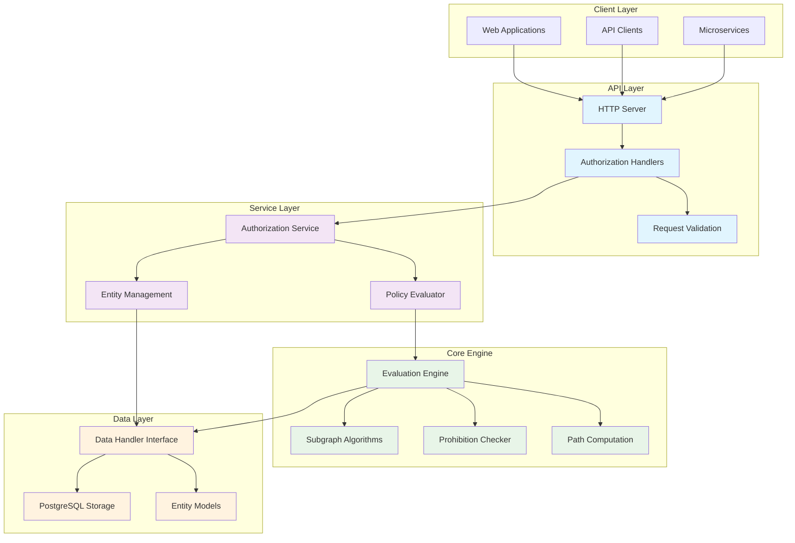
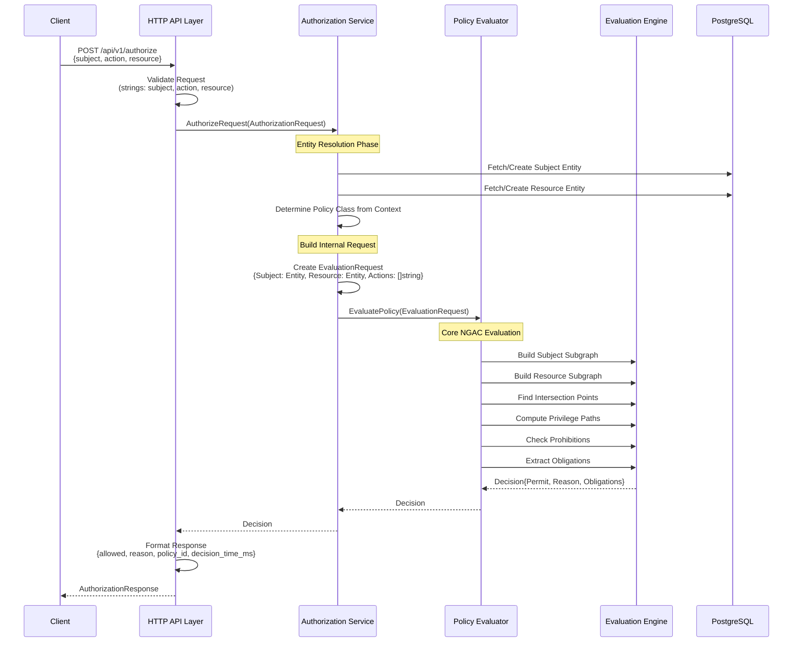

# Authorization Engine

[](https://golang.org/)

**A high-performance authorization engine** that provides a simple API for access control decisions while leveraging the sophisticated NGAC policy machine underneath.

## Table of Contents

- [Overview](#overview)
- [Architecture](#architecture)
- [Authorization Flow](#authorization-flow)
- [Request Types](#request-types)
- [Service Interfaces](#service-interfaces)
- [Performance](#performance)
- [Usage Examples](#usage-examples)
- [Integration Guide](#integration-guide)

## Overview

The Authorization Engine provides a clean, high-level API for making authorization decisions. It acts as the bridge between simple HTTP authorization requests and the sophisticated NGAC policy evaluation engine.

### Key Features

- **Simple API**: Single authorization endpoint that works with all access control models
- **High Performance**: Sub-20ms response times with optimized evaluation paths
- **Entity Management**: Automatic subject and resource creation and caching
- **Context-Aware**: Smart policy class determination from request context
- **Scalable**: Concurrent processing and optimized data structures
- **Observable**: Built-in timing, reasoning, and audit trails

## Architecture

### Layered Authorization Architecture

The system features a **layered authorization architecture** that separates public API concerns from internal policy evaluation:



### Key Architectural Changes

#### Separation of Concerns
- **API Layer** (`AuthorizeRequest`): Handles HTTP requests, validation, and entity resolution
- **Service Layer** (`EvaluatePolicy`): Core policy evaluation with resolved entities
- **Data Layer**: NGAC-compliant storage and retrieval

#### Performance Benefits
- **Entity Resolution**: Performed once in API layer, not during core evaluation
- **Concurrent Subgraph Building**: Subject and resource graphs built in parallel
- **Type Safety**: Resolved entities prevent runtime lookup errors
- **Caching Friendly**: Internal evaluation requests are cache-optimized

#### NGAC Compliance Enhancements
- **Policy Class Isolation**: Explicit policy class context for multi-tenant scenarios
- **Obligation Support**: Request-level obligation tracking and extraction
- **Prohibition Handling**: Dedicated prohibition checking with entity-aware intersection logic
- **Audit Trail**: Request IDs and detailed decision reasoning

## Authorization Flow

### Complete Authorization Flow



### Flow Phases

1. **Request Validation**: HTTP layer validates input format and required fields
2. **Entity Resolution**: Convert string IDs to resolved entity objects
3. **Policy Class Determination**: Analyze request context to determine applicable policy class
4. **Internal Request Creation**: Build optimized internal evaluation request
5. **NGAC Evaluation**: Core policy engine performs graph-based evaluation
6. **Response Formatting**: Convert internal decision to HTTP response format

## Request Types

### Public API Request (HTTP Layer)

```go
// AuthorizationRequest represents a request from external clients
type AuthorizationRequest struct {
    Subject  string                 `json:"subject" binding:"required"`   // String ID from client
    Action   string                 `json:"action" binding:"required"`    // Single action
    Resource string                 `json:"resource" binding:"required"`  // String ID from client
    Context  map[string]interface{} `json:"context,omitempty"`           // Flexible context
}
```

**Example:**
```json
{
  "subject": "user123",
  "action": "read",
  "resource": "document456",
  "context": {
    "ip": "192.168.1.1",
    "tenant": "acme-corp",
    "department": "engineering"
  }
}
```

### Internal Evaluation Request (Service Layer)

```go
// EvaluationRequest represents an internal policy evaluation request with resolved entities
type EvaluationRequest struct {
    Subject     model.Entity      `json:"subject"`      // Resolved entity
    Resource    model.Entity      `json:"resource"`     // Resolved entity
    Actions     []string          `json:"actions"`      // Multiple actions supported
    PolicyClass string            `json:"policy_class"` // Explicit policy class
    Context     map[string]string `json:"context,omitempty"` // Normalized context
    RequestID   string            `json:"request_id,omitempty"` // Request tracking
}
```

### Authorization Response

```go
// AuthorizationResponse represents the response to an authorization request
type AuthorizationResponse struct {
    Allowed        bool   `json:"allowed"`                    // Whether the action is allowed
    Reason         string `json:"reason,omitempty"`           // Reason for the decision
    PolicyID       string `json:"policy_id,omitempty"`        // Policy that made the decision
    DecisionTimeMs int64  `json:"decision_time_ms,omitempty"` // Decision time in milliseconds
}
```

## Service Interfaces

### Authorization Service Interface

```go
type AuthorizationService interface {
    // AuthorizeRequest performs authorization evaluation for an HTTP request
    AuthorizeRequest(ctx context.Context, authRequest *model.AuthorizationRequest) (*Decision, error)
}
```

### Policy Evaluator Interface

```go
type PolicyEvaluator interface {
    // EvaluatePolicy performs core policy evaluation with resolved entities
    EvaluatePolicy(ctx context.Context, req *EvaluationRequest) (*Decision, error)
}
```

### Entity Service Interface

```go
type EntityService interface {
    // FetchOrCreateSubject fetches a subject or creates a basic one if not found
    FetchOrCreateSubject(subjectID string) (*model.Subject, error)
    
    // FetchOrCreateResource fetches a resource or creates a basic one if not found
    FetchOrCreateResource(resourceID string) (*model.Resource, error)
    
    // DeterminePolicyClass determines which policy class to use based on context
    DeterminePolicyClass(authRequest *model.AuthorizationRequest) string
}
```

### Decision Structure

```go
type Decision struct {
    Permit       bool                 `json:"permit"`                // Authorization decision
    Reason       string               `json:"reason,omitempty"`      // Human-readable reason
    Obligations  []string             `json:"obligations,omitempty"` // Required obligations
    Conditions   []string             `json:"conditions,omitempty"`  // Required conditions
    Timestamp    time.Time            `json:"timestamp"`             // Decision timestamp
    PolicyPath   []*model.Entity      `json:"policy_path,omitempty"` // Entities in decision path
    Prohibitions []*model.Prohibition `json:"prohibitions,omitempty"` // Applicable prohibitions
}
```

## Performance

### Architectural Performance Benefits
- **Layered Evaluation**: API and core evaluation concerns separated for optimal performance
- **Entity Resolution Optimization**: Entities resolved once in API layer, not during core evaluation
- **Request Type Efficiency**: Internal `EvaluationRequest` optimized for core engine performance
- **Policy Class Isolation**: Explicit policy class scoping reduces evaluation search space

### API Layer Performance
- **Sub-20ms Authorization**: Complete authorization decisions in under 20ms
- **Entity Caching**: Subject and resource entities cached to avoid repeated database lookups
- **Context Processing**: Efficient policy class determination from request context
- **Parallel Entity Resolution**: Subject and resource entities fetched concurrently

### Performance Monitoring

```go
type PerformanceMetrics struct {
    RequestCount        int64         `json:"request_count"`
    AverageResponseTime time.Duration `json:"average_response_time"`
    CacheHitRatio       float64       `json:"cache_hit_ratio"`
    EntityResolutionTime time.Duration `json:"entity_resolution_time"`
    EvaluationTime      time.Duration `json:"evaluation_time"`
}

func (e *Evaluator) GetMetrics() *PerformanceMetrics {
    return &PerformanceMetrics{
        RequestCount:        atomic.LoadInt64(&e.requestCount),
        AverageResponseTime: e.calculateAverageResponseTime(),
        CacheHitRatio:       e.calculateCacheHitRatio(),
        EntityResolutionTime: e.averageEntityResolutionTime(),
        EvaluationTime:      e.averageEvaluationTime(),
    }
}
```

## Usage Examples

### Basic Authorization

```go
package main

import (
    "context"
    "fmt"
    "log"
    
    "github.com/kumarabd/policy-machine/pkg/model"
    "github.com/kumarabd/policy-machine/pkg/service"
    "github.com/kumarabd/policy-machine/pkg/postgres"
    "github.com/kumarabd/gokit/logger"
)

func main() {
    // Initialize logger
    log, _ := logger.New("auth-engine", logger.Options{})
    
    // Initialize database
    dbConfig := &postgres.Options{
        Host:     "localhost",
        Port:     5432,
        Database: "policy_db",
        Username: "user",
        Password: "password",
    }
    
    dataHandler, err := postgres.NewHandler(dbConfig)
    if err != nil {
        log.Fatal().Err(err).Msg("Failed to initialize database")
    }
    
    // Create evaluator
    evaluator := service.NewEvaluator(log, dataHandler)
    
    // Make authorization request
    authRequest := &model.AuthorizationRequest{
        Subject:  "alice",
        Action:   "read",
        Resource: "document-123",
        Context: map[string]interface{}{
            "department": "engineering",
            "tenant":     "acme-corp",
        },
    }
    
    decision, err := evaluator.AuthorizeRequest(context.Background(), authRequest)
    if err != nil {
        log.Error().Err(err).Msg("Authorization failed")
        return
    }
    
    if decision.Permit {
        fmt.Printf("Access GRANTED: %s\n", decision.Reason)
    } else {
        fmt.Printf("Access DENIED: %s\n", decision.Reason)
    }
}
```

### Advanced Authorization with Context

```go
func advancedAuthorization() {
    // Create authorization request with rich context
    authRequest := &model.AuthorizationRequest{
        Subject:  "dr-smith",
        Action:   "read",
        Resource: "patient-records-db",
        Context: map[string]interface{}{
            "department":     "medical",
            "clearance":      "high",
            "shift":          "day",
            "location":       "hospital-main",
            "authentication": "strong",
            "tenant":         "hospital-system",
        },
    }
    
    decision, err := evaluator.AuthorizeRequest(context.Background(), authRequest)
    if err != nil {
        log.Error().Err(err).Msg("Authorization failed")
        return
    }
    
    fmt.Printf("Decision: %v\n", decision.Permit)
    fmt.Printf("Reason: %s\n", decision.Reason)
    fmt.Printf("Obligations: %v\n", decision.Obligations)
    fmt.Printf("Policy Path: %d entities\n", len(decision.PolicyPath))
}
```

### Batch Authorization

```go
func batchAuthorization(requests []*model.AuthorizationRequest) {
    results := make(chan *Decision, len(requests))
    
    // Process requests concurrently
    for _, req := range requests {
        go func(r *model.AuthorizationRequest) {
            decision, err := evaluator.AuthorizeRequest(context.Background(), r)
            if err != nil {
                log.Error().Err(err).Str("subject", r.Subject).Msg("Authorization failed")
                results <- &Decision{Permit: false, Reason: "evaluation error"}
                return
            }
            results <- decision
        }(req)
    }
    
    // Collect results
    for i := 0; i < len(requests); i++ {
        decision := <-results
        fmt.Printf("Request %d: %v - %s\n", i+1, decision.Permit, decision.Reason)
    }
}
```

### Custom Policy Class Determination

```go
type CustomEvaluator struct {
    *service.Evaluator
}

func (c *CustomEvaluator) DeterminePolicyClass(authRequest *model.AuthorizationRequest) string {
    // Custom logic for policy class determination
    if authRequest.Context != nil {
        // Priority 1: Explicit policy class
        if policyClass, exists := authRequest.Context["policy_class"]; exists {
            if str, ok := policyClass.(string); ok && str != "" {
                return str
            }
        }
        
        // Priority 2: Business unit based
        if businessUnit, exists := authRequest.Context["business_unit"]; exists {
            if str, ok := businessUnit.(string); ok && str != "" {
                return fmt.Sprintf("bu-%s", str)
            }
        }
        
        // Priority 3: Geographic region
        if region, exists := authRequest.Context["region"]; exists {
            if str, ok := region.(string); ok && str != "" {
                return fmt.Sprintf("region-%s", str)
            }
        }
        
        // Priority 4: Environment based
        if env, exists := authRequest.Context["environment"]; exists {
            if str, ok := env.(string); ok && str != "" {
                return fmt.Sprintf("env-%s", str)
            }
        }
    }
    
    // Default policy class
    return "default"
}
```

## Integration Guide

### HTTP Handler Integration

```go
func AuthorizeHandler(w http.ResponseWriter, r *http.Request) {
    w.Header().Set("Content-Type", "application/json")
    
    start := time.Now()
    
    // Parse request body
    var authRequest model.AuthorizationRequest
    if err := json.NewDecoder(r.Body).Decode(&authRequest); err != nil {
        w.WriteHeader(http.StatusBadRequest)
        json.NewEncoder(w).Encode(map[string]string{
            "error": "invalid_request",
            "message": "Invalid JSON in request body",
        })
        return
    }
    
    // Validate required fields
    if authRequest.Subject == "" || authRequest.Action == "" || authRequest.Resource == "" {
        w.WriteHeader(http.StatusBadRequest)
        json.NewEncoder(w).Encode(map[string]string{
            "error": "validation_error",
            "message": "Subject, action, and resource are required",
        })
        return
    }
    
    // Perform authorization
    decision, err := evaluator.AuthorizeRequest(r.Context(), &authRequest)
    if err != nil {
        w.WriteHeader(http.StatusInternalServerError)
        json.NewEncoder(w).Encode(map[string]string{
            "error": "evaluation_error",
            "message": "Failed to evaluate authorization request",
        })
        return
    }
    
    decisionTime := time.Since(start).Milliseconds()
    
    response := model.AuthorizationResponse{
        Allowed:        decision.Permit,
        Reason:         decision.Reason,
        PolicyID:       extractPolicyID(decision),
        DecisionTimeMs: decisionTime,
    }
    
    w.WriteHeader(http.StatusOK)
    json.NewEncoder(w).Encode(response)
}
```

### Middleware Integration

```go
func AuthorizationMiddleware(evaluator *service.Evaluator) func(http.Handler) http.Handler {
    return func(next http.Handler) http.Handler {
        return http.HandlerFunc(func(w http.ResponseWriter, r *http.Request) {
            // Extract authorization context from request
            subject := r.Header.Get("X-User-ID")
            action := r.Method
            resource := r.URL.Path
            
            authRequest := &model.AuthorizationRequest{
                Subject:  subject,
                Action:   action,
                Resource: resource,
                Context: map[string]interface{}{
                    "ip":         r.RemoteAddr,
                    "user_agent": r.UserAgent(),
                    "method":     r.Method,
                    "path":       r.URL.Path,
                },
            }
            
            decision, err := evaluator.AuthorizeRequest(r.Context(), authRequest)
            if err != nil || !decision.Permit {
                w.WriteHeader(http.StatusForbidden)
                json.NewEncoder(w).Encode(map[string]string{
                    "error": "access_denied",
                    "message": decision.Reason,
                })
                return
            }
            
            // Add authorization info to request context
            ctx := context.WithValue(r.Context(), "authorization_decision", decision)
            next.ServeHTTP(w, r.WithContext(ctx))
        })
    }
}
```

### gRPC Integration

```go
func (s *AuthService) Authorize(ctx context.Context, req *authpb.AuthorizeRequest) (*authpb.AuthorizeResponse, error) {
    authRequest := &model.AuthorizationRequest{
        Subject:  req.Subject,
        Action:   req.Action,
        Resource: req.Resource,
        Context:  convertToMap(req.Context),
    }
    
    decision, err := s.evaluator.AuthorizeRequest(ctx, authRequest)
    if err != nil {
        return nil, status.Errorf(codes.Internal, "authorization evaluation failed: %v", err)
    }
    
    return &authpb.AuthorizeResponse{
        Allowed:        decision.Permit,
        Reason:         decision.Reason,
        Obligations:    decision.Obligations,
        DecisionTimeMs: time.Since(start).Milliseconds(),
    }, nil
}

func convertToMap(contextPairs []*authpb.KeyValue) map[string]interface{} {
    result := make(map[string]interface{})
    for _, pair := range contextPairs {
        result[pair.Key] = pair.Value
    }
    return result
}
```
