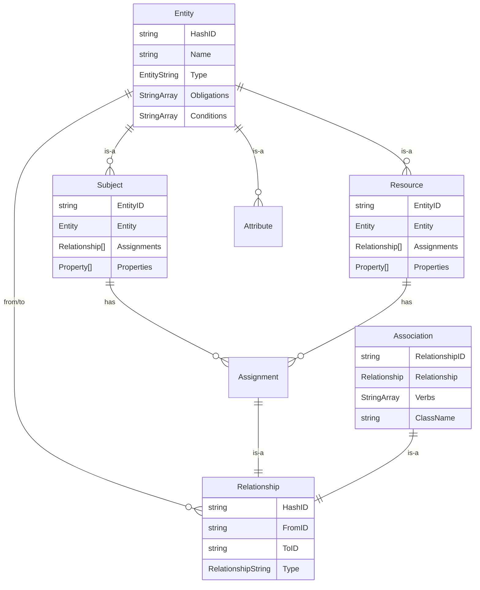
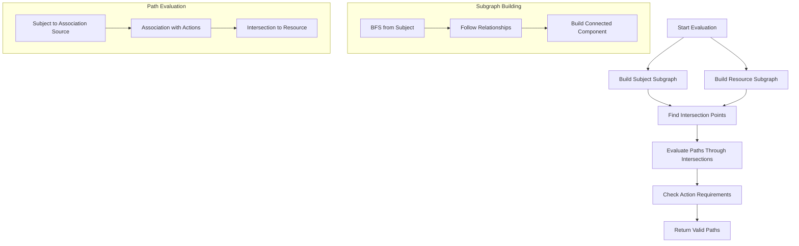

# Policy Machine - NGAC Implementation

[](https://nvlpubs.nist.gov/nistpubs/SpecialPublications/NIST.SP.800-162.pdf)

**A sophisticated access control library implementing the NGAC (Next Generation Access Control) standard** as defined by NIST Special Publication 800-162. It provides a unified framework that combines relationship-based and attribute-based access control with graph-based policy evaluation algorithms.

## Table of Contents

- [Overview](#overview)
- [NGAC Compliance](#ngac-compliance)
- [Core Concepts](#core-concepts)
- [Data Models](#data-models)
- [Policy Evaluation](#policy-evaluation)
- [API Reference](#api-reference)
- [Usage Examples](#usage-examples)
- [Advanced Features](#advanced-features)
- [Performance](#performance)

## Overview

The Policy Engine is a sophisticated access control library implementing the **NGAC (Next Generation Access Control)** standard as defined by NIST Special Publication 800-162. It provides a unified framework that combines relationship-based and attribute-based access control with graph-based policy evaluation algorithms.

### Key Features

- **NIST NGAC Compliance**: Full implementation of NGAC standard components and evaluation algorithms
- **Policy Classes**: Multi-tenant isolation with context-specific policy evaluation  
- **User & Object Attributes**: Fine-grained attribute-based access control
- **Assignments & Associations**: NGAC-compliant entity relationships and permissions
- **Prohibitions**: Native support for negative permissions and deny rules
- **Graph-Based Evaluation**: Efficient subgraph algorithms for path-based permission evaluation
- **High Performance**: Optimized evaluation algorithms with concurrent processing
- **PostgreSQL Backend**: Persistent storage with GORM ORM integration
- **Standards-Based API**: NGAC-compliant builder patterns and evaluation interface

## NGAC Compliance

This implementation provides full compliance with NIST SP 800-162 NGAC standard:

### NGAC Core Elements
- ✅ **Policy Classes**: Multi-tenant policy containers
- ✅ **Users & User Attributes**: Subject entities and their attributes
- ✅ **Objects & Object Attributes**: Resource entities and their attributes  
- ✅ **Assignments**: User-to-attribute and object-to-attribute assignments
- ✅ **Associations**: User attribute to object attribute permissions
- ✅ **Prohibitions**: Negative permissions with deny precedence
- ✅ **Operations**: Fine-grained action specifications
- ✅ **Obligations**: Policy evaluation conditions

### NGAC Evaluation Components
- ✅ **Privilege Calculation**: Graph-based privilege path computation
- ✅ **Prohibition Processing**: Deny rule evaluation with override semantics
- ✅ **Administrative Functions**: Policy management operations
- ✅ **Access Decision Functions**: Standards-compliant decision rendering

## Core Concepts

### NGAC Components

The policy engine implements the complete NGAC model as defined by NIST SP 800-162, including:



### NGAC Relationship Types

1. **Assignment Relationships**: Entity-to-attribute associations per NGAC standard
   - Link users/objects to their attributes in the access control graph
   - Example: User "alice" assigned to attribute "department:engineering"

2. **Association Relationships**: User/object attribute permissions with operations
   - Define operations that user attributes can perform on object attributes
   - Example: User attribute "role:admin" associated with object attribute "resource:database" for operations ["read","write","delete"]

3. **Prohibition Relationships**: Negative permissions (NGAC deny rules)
   - Explicit deny rules that override positive permissions
   - Example: Prohibition preventing "department:intern" from "delete" operations on "sensitive:classified" resources

### Policy Classes

Policy classes provide multi-tenant isolation and context-specific policy evaluation:

```go
type PolicyClass struct {
    Name        string
    Obligations []string
    Conditions  []string
    Policies    []Policy
}
```

## Data Models

### Entity Model

The base entity model provides identity and metadata for all policy engine objects:

```go
type Entity struct {
    HashID      string       `gorm:"primaryKey;uniqueIndex"`
    Type        EntityString `gorm:"index"`
    Name        string
    Obligations []string     `gorm:"type:text[]"`
    Conditions  []string     `gorm:"type:text[]"`
}

// Supported entity types
const (
    SubjectEntity           EntityString = "subject"
    ResourceEntity          EntityString = "resource"
    SubjectAttributeEntity  EntityString = "subject_attribute"
    ResourceAttributeEntity EntityString = "resource_attribute"
)
```

### Subject Model

Subjects represent entities that can perform actions (users, services, roles):

```go
type Subject struct {
    EntityID    string         `gorm:"primaryKey;uniqueIndex"`
    Entity      *Entity        `gorm:"foreignKey:HashID;references:EntityID"`
    Assignments []Relationship `gorm:"foreignKey:FromID;references:EntityID"`
    Properties  []*Property    `gorm:"many2many:subject_properties"`
}
```

### Resource Model

Resources represent entities that can be accessed (files, databases, services):

```go
type Resource struct {
    EntityID    string         `gorm:"primaryKey;uniqueIndex"`
    Entity      *Entity        `gorm:"foreignKey:HashID;references:EntityID"`
    Assignments []Relationship `gorm:"foreignKey:FromID;references:EntityID"`
    Properties  []*Property    `gorm:"many2many:resource_properties"`
}
```

### Relationship Model

Relationships define connections between entities:

```go
type Relationship struct {
    HashID      string             `gorm:"primaryKey;uniqueIndex"`
    FromID      string             `gorm:"index"`
    ToID        string             `gorm:"index"`
    Type        RelationshipString `gorm:"index"`
    Obligations []string           `gorm:"type:text[]"`
    Conditions  []string           `gorm:"type:text[]"`
}

// Relationship types
const (
    AssignmentRelationship  RelationshipString = "assignment"
    AssociationRelationship RelationshipString = "association"
)
```

### Association Model

Associations define permissions with specific actions:

```go
type Association struct {
    RelationshipID string         `gorm:"primaryKey;uniqueIndex"`
    Relationship   *Relationship  `gorm:"foreignKey:HashID;references:RelationshipID"`
    Verbs          []string       `gorm:"type:text[]"`
    ClassName      string         `gorm:"index"`
}
```

## Policy Evaluation

### NGAC Evaluation Algorithm

The policy engine implements the NGAC standard evaluation algorithm using advanced subgraph-based computation for efficient policy evaluation:



### Performance Characteristics

#### Core Engine Performance
- **Time Complexity**: O(V + E) for subgraph building, where V is vertices and E is edges
- **Space Complexity**: O(V) for storing subgraph nodes  
- **Concurrent Processing**: Subject and resource subgraphs built in parallel
- **Maximum Depth**: Configurable depth limit (default: 10) to prevent infinite loops
- **Subgraph Caching**: In-memory subgraph caching for repeated evaluations

### NGAC Evaluation Steps

1. **Subgraph Construction**: Build connected components from user and object entities following NGAC graph traversal
2. **Intersection Discovery**: Find user/object attribute nodes that exist in both subgraphs with association relationships
3. **Path Computation**: Calculate valid privilege paths through intersection points per NGAC privilege calculation
4. **Prohibition Check**: Verify no applicable prohibitions (deny rules) override positive permissions
5. **Action Validation**: Verify that associations have required operations
6. **Decision Rendering**: Return NGAC-compliant access decision with obligations and conditions

## API Reference

### DataHandler Interface

The core interface for all database operations:

```go
type DataHandler interface {
    // Entity operations
    Ping() (string, error)
    FetchEntityForID(string, *model.Entity) error
    FetchRelationshipsForSource(string, *[]model.Relationship) error
    
    // Subject operations
    AddSubject(*model.Subject) error
    AddSubjectIfDoesntExist(*model.Subject) error
    FetchSubject(*model.Subject, bool) error
    FetchOrCreateSubject(*model.Subject, bool) error
    
    // Resource operations
    AddResource(*model.Resource) error
    FetchResource(*model.Resource, bool) error
    
    // Policy operations
    AddPolicy(*model.Policy) error
    FetchPolicy(*model.Policy, bool) error
    AddPolicyClass(*model.PolicyClass) error
    
    // Association operations
    AddAssociation(*model.Association) error
    FetchAssociation(*model.Association, bool) error
    AddActions(*model.Association, []string) error
    
    // Assignment operations
    AddAssignment(*model.Assignment) error
    FetchAssignment(*model.Assignment, bool) error
    
    // Attribute operations
    AddAttribute(*model.Attribute) error
    FetchAttribute(*model.Attribute, bool) error
    FetchOrCreateAttribute(*model.Attribute, bool) error
    
    // Bulk operations
    AddSubjectBulk([]*model.Subject) error
    AddResourceBulk([]*model.Resource) error
    AddAssociationBulk([]*model.Association) error
    AddAssignmentBulk([]*model.Assignment) error
    AddAttributeBulk([]*model.Attribute) error
    AddPolicyBulk([]*model.Policy) error
    AddPolicyClassBulk([]*model.PolicyClass) error
    
    // Database access
    DB() *sql.DB
}
```

### Builder APIs

#### Policy Class Builder

```go
// Create a new policy class
builder := api.PolicyClassBuilder("tenant-name")
err := builder.Exec(dataHandler)
```

#### Subject Builder

```go
// Create subject with properties
builder := api.SubjectBuilder("user-name", map[string]string{
    "department": "engineering",
    "role":       "developer",
})
err := builder.Create(dataHandler)

// Fetch existing subject by ID
builder := api.SubjectBuilderWithID("existing-subject-id")
err := builder.Fetch(dataHandler)
```

#### Resource Builder

```go
// Create resource with properties
builder := api.ResourceBuilder("resource-name", map[string]string{
    "type":        "database",
    "environment": "production",
})
err := builder.Create(dataHandler)

// Fetch existing resource by ID
builder := api.ResourceBuilderWithID("existing-resource-id")
err := builder.Fetch(dataHandler)
```

#### Direct Policy Builder

```go
// Create a direct policy
builder, err := api.DirectPolicyBuilder(
    "policy-class",
    map[string]string{"role": "admin"},      // Subject criteria
    map[string]string{"type": "database"},   // Resource criteria
    []string{"read", "write", "delete"},     // Actions
)
if err != nil {
    return err
}
err = builder.Exec(dataHandler)
```

## Usage Examples

### Example 1: Role-Based Access Control (RBAC)

```go
// Create role-based policies
func setupRBAC(dataHandler api.DataHandler) error {
    // Create policy class
    err := api.PolicyClassBuilder("rbac-demo").Exec(dataHandler)
    if err != nil {
        return err
    }
    
    // Create users
    alice := api.SubjectBuilder("alice", map[string]string{
        "role": "developer",
        "team": "backend",
    })
    err = alice.Create(dataHandler)
    if err != nil {
        return err
    }
    
    bob := api.SubjectBuilder("bob", map[string]string{
        "role": "admin",
        "team": "platform",
    })
    err = bob.Create(dataHandler)
    if err != nil {
        return err
    }
    
    // Create resources
    prodDB := api.ResourceBuilder("prod-database", map[string]string{
        "environment": "production",
        "type":        "database",
    })
    err = prodDB.Create(dataHandler)
    if err != nil {
        return err
    }
    
    devDB := api.ResourceBuilder("dev-database", map[string]string{
        "environment": "development",
        "type":        "database",
    })
    err = devDB.Create(dataHandler)
    if err != nil {
        return err
    }
    
    // Create policies
    // Developers can read/write dev databases
    devPolicy, err := api.DirectPolicyBuilder(
        "rbac-demo",
        map[string]string{"role": "developer"},
        map[string]string{"environment": "development"},
        []string{"read", "write"},
    )
    if err != nil {
        return err
    }
    err = devPolicy.Exec(dataHandler)
    if err != nil {
        return err
    }
    
    // Admins can do everything on all databases
    adminPolicy, err := api.DirectPolicyBuilder(
        "rbac-demo",
        map[string]string{"role": "admin"},
        map[string]string{"type": "database"},
        []string{"read", "write", "delete", "admin"},
    )
    if err != nil {
        return err
    }
    err = adminPolicy.Exec(dataHandler)
    
    return nil
}
```

### Example 2: Attribute-Based Access Control (ABAC)

```go
// Create attribute-based policies
func setupABAC(dataHandler api.DataHandler) error {
    // Create policy class
    err := api.PolicyClassBuilder("abac-demo").Exec(dataHandler)
    if err != nil {
        return err
    }
    
    // Create user with multiple attributes
    researcher := api.SubjectBuilder("dr-smith", map[string]string{
        "department":   "research",
        "clearance":    "secret",
        "project":      "project-alpha",
        "role":         "principal-investigator",
    })
    err = researcher.Create(dataHandler)
    if err != nil {
        return err
    }
    
    // Create classified resource
    classifiedData := api.ResourceBuilder("alpha-dataset", map[string]string{
        "classification": "secret",
        "project":        "project-alpha",
        "type":           "dataset",
        "sensitivity":    "high",
    })
    err = classifiedData.Create(dataHandler)
    if err != nil {
        return err
    }
    
    // Create complex policy: access requires matching project AND sufficient clearance
    policy, err := api.DirectPolicyBuilder(
        "abac-demo",
        map[string]string{
            "clearance": "secret",
            "project":   "project-alpha",
        },
        map[string]string{
            "classification": "secret",
            "type":           "dataset",
        },
        []string{"read", "analyze"},
    )
    if err != nil {
        return err
    }
    err = policy.Exec(dataHandler)
    
    return nil
}
```

### Example 3: Prohibition (Deny Rules)

```go
// Create prohibition policies
func setupProhibitions(dataHandler api.DataHandler) error {
    // Create policy class
    err := api.PolicyClassBuilder("prohibition-demo").Exec(dataHandler)
    if err != nil {
        return err
    }
    
    // Create intern user
    intern := api.SubjectBuilder("intern-user", map[string]string{
        "role":       "intern",
        "department": "engineering",
    })
    err = intern.Create(dataHandler)
    if err != nil {
        return err
    }
    
    // Create sensitive resource
    sensitiveDB := api.ResourceBuilder("sensitive-database", map[string]string{
        "type":        "database",
        "sensitivity": "high",
        "environment": "production",
    })
    err = sensitiveDB.Create(dataHandler)
    if err != nil {
        return err
    }
    
    // Allow engineering department to access databases
    allowPolicy, err := api.DirectPolicyBuilder(
        "prohibition-demo",
        map[string]string{"department": "engineering"},
        map[string]string{"type": "database"},
        []string{"read", "write", "delete"},
    )
    if err != nil {
        return err
    }
    err = allowPolicy.Exec(dataHandler)
    if err != nil {
        return err
    }
    
    // But prohibit interns from delete operations on sensitive resources
    prohibitPolicy, err := api.DirectPolicyBuilder(
        "prohibition-demo",
        map[string]string{"role": "intern"},
        map[string]string{"sensitivity": "high"},
        []string{"delete"},
    )
    if err != nil {
        return err
    }
    err = prohibitPolicy.Exec(dataHandler)
    
    return nil
}
```

## Advanced Features

### Multi-Tenant Policy Classes

```go
// Create tenant-specific policy classes
func setupMultiTenant(dataHandler api.DataHandler) error {
    // Tenant A policy class
    err := api.PolicyClassBuilder("tenant-a").Exec(dataHandler)
    if err != nil {
        return err
    }
    
    // Tenant B policy class
    err = api.PolicyClassBuilder("tenant-b").Exec(dataHandler)
    if err != nil {
        return err
    }
    
    // Each tenant has isolated policies
    tenantAPolicy, err := api.DirectPolicyBuilder(
        "tenant-a",
        map[string]string{"role": "user"},
        map[string]string{"tenant": "a"},
        []string{"read", "write"},
    )
    if err != nil {
        return err
    }
    err = tenantAPolicy.Exec(dataHandler)
    
    tenantBPolicy, err := api.DirectPolicyBuilder(
        "tenant-b",
        map[string]string{"role": "user"},
        map[string]string{"tenant": "b"},
        []string{"read", "write"},
    )
    if err != nil {
        return err
    }
    err = tenantBPolicy.Exec(dataHandler)
    
    return nil
}
```

### Obligations and Conditions

```go
// Create policies with obligations
func setupObligations(dataHandler api.DataHandler) error {
    // Policy with obligations
    builder, err := api.DirectPolicyBuilder(
        "obligation-demo",
        map[string]string{"role": "analyst"},
        map[string]string{"type": "financial-data"},
        []string{"read"},
    )
    if err != nil {
        return err
    }
    
    // Add obligations that must be fulfilled
    builder.WithObligations([]string{
        "log-access",
        "encrypt-response",
        "notify-compliance",
    })
    
    err = builder.Exec(dataHandler)
    return nil
}
```

### Hierarchical Attributes

```go
// Create hierarchical attribute structures
func setupHierarchy(dataHandler api.DataHandler) error {
    // Create organizational hierarchy
    ceo := api.SubjectBuilder("ceo", map[string]string{
        "role":  "ceo",
        "level": "executive",
    })
    err = ceo.Create(dataHandler)
    if err != nil {
        return err
    }
    
    manager := api.SubjectBuilder("manager", map[string]string{
        "role":       "manager",
        "level":      "management",
        "department": "engineering",
    })
    err = manager.Create(dataHandler)
    if err != nil {
        return err
    }
    
    developer := api.SubjectBuilder("developer", map[string]string{
        "role":       "developer",
        "level":      "individual",
        "department": "engineering",
    })
    err = developer.Create(dataHandler)
    if err != nil {
        return err
    }
    
    // Create hierarchical policies
    // Executives can access everything
    execPolicy, err := api.DirectPolicyBuilder(
        "hierarchy-demo",
        map[string]string{"level": "executive"},
        map[string]string{"*": "*"}, // Wildcard access
        []string{"read", "write", "delete", "admin"},
    )
    if err != nil {
        return err
    }
    err = execPolicy.Exec(dataHandler)
    
    // Managers can access their department resources
    mgmtPolicy, err := api.DirectPolicyBuilder(
        "hierarchy-demo",
        map[string]string{
            "level":      "management",
            "department": "engineering",
        },
        map[string]string{"department": "engineering"},
        []string{"read", "write", "manage"},
    )
    if err != nil {
        return err
    }
    err = mgmtPolicy.Exec(dataHandler)
    
    return nil
}
```

## Performance

### Optimization Strategies

1. **Bulk Operations**: Use bulk insert methods for creating multiple entities
2. **Index Usage**: Leverage PostgreSQL indexes on HashID, Type, and relationship fields
3. **Subgraph Caching**: Cache frequently accessed subgraphs
4. **Depth Limiting**: Configure appropriate maximum traversal depth
5. **Connection Pooling**: Use database connection pooling for concurrent access

### Monitoring and Metrics

```go
// Add performance monitoring
type PerformanceMonitor struct {
    evaluationTimes []time.Duration
    pathCounts      []int
    cacheHits       int64
    cacheMisses     int64
}

func (p *PerformanceMonitor) RecordEvaluation(duration time.Duration, pathCount int) {
    p.evaluationTimes = append(p.evaluationTimes, duration)
    p.pathCounts = append(p.pathCounts, pathCount)
}

func (p *PerformanceMonitor) GetStats() map[string]interface{} {
    return map[string]interface{}{
        "avg_evaluation_time": p.averageEvaluationTime(),
        "avg_path_count":      p.averagePathCount(),
        "cache_hit_ratio":     float64(p.cacheHits) / float64(p.cacheHits + p.cacheMisses),
    }
}
```
