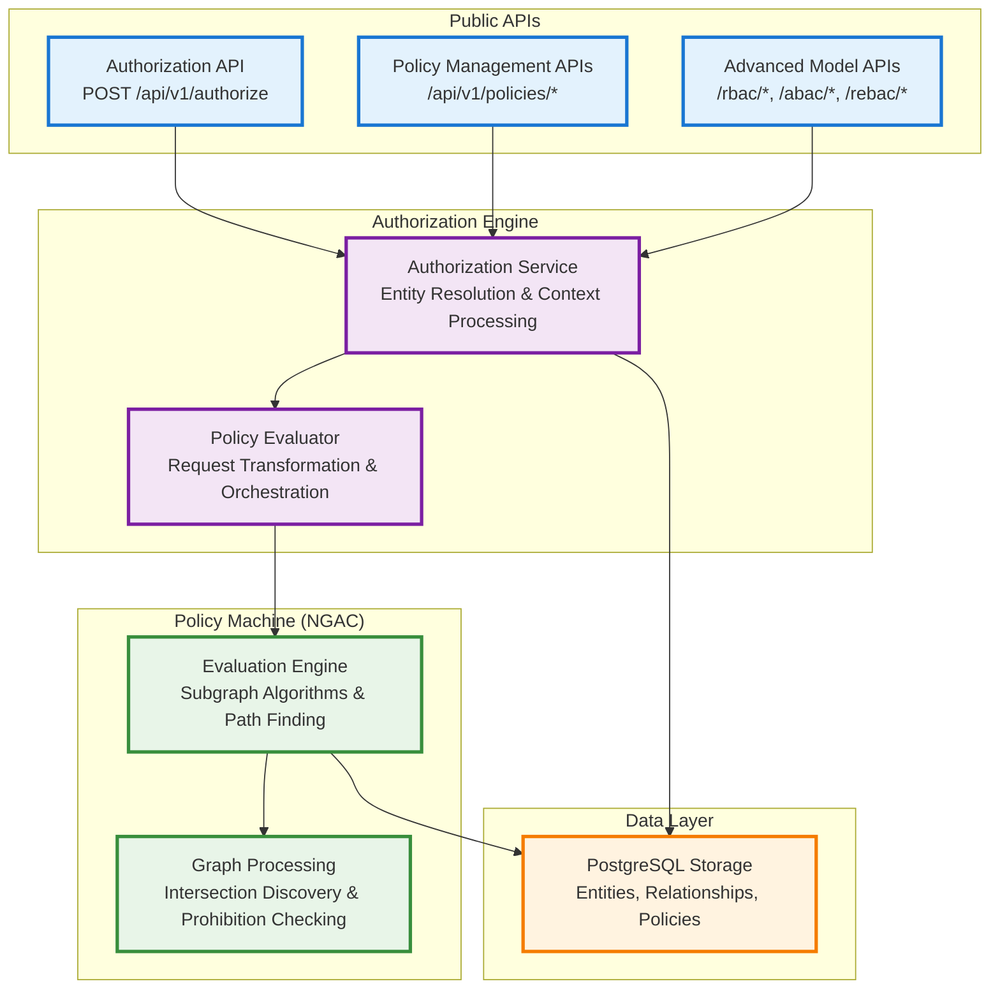

# Policy Machine + Auth Engine API

[](https://golang.org/)
[](https://postgresql.org/)
[](https://gorm.io/)
[](https://nvlpubs.nist.gov/nistpubs/SpecialPublications/NIST.SP.800-162.pdf)

**A unified access control system** that provides a simple authorization API alongside comprehensive policy management capabilities. Start simple with our main authorization endpoint, then expand to advanced access control models as needed.

## 📚 Documentation

- **[Authorization Engine](AuthEngine.md)** - High-level authorization API, request handling, and integration guide
- **[Policy Machine](PolicyMachine.md)** - NGAC-compliant policy engine, core concepts, and advanced features

## Table of Contents

- [🚀 Quick Start](#-quick-start)
- [📡 API Overview](#-api-overview)
- [⚡ Core Authorization](#-core-authorization)
- [🛠️ Policy Management](#️-policy-management)
- [🎯 Advanced APIs](#-advanced-apis)
- [🏗️ System Architecture](#️-system-architecture)
- [📥 Installation](#-installation)

## 🚀 Quick Start

### The 30-Second Authorization Setup

```bash
# Start the server
go run cmd/main.go --config internal/config/config.yaml
```

```bash
# Make authorization requests
curl -X POST http://localhost:8080/api/v1/authorize \
  -H "Content-Type: application/json" \
  -d '{
    "subject": "user123",
    "action": "read", 
    "resource": "document456"
  }'
```

**Response:**
```json
{
  "allowed": true,
  "reason": "User has admin role with read permission",
  "policy_id": "rbac-admin-policy",
  "decision_time_ms": 15
}
```

### Swagger Documentation

🔍 **Interactive API Explorer:** `http://localhost:8080/swagger/index.html`

## 📡 API Overview

Our API is designed with a **layered approach** for different user needs:

```
🔵 CORE APIs (Start Here)
├── POST /api/v1/authorize          # ⭐ Main authorization endpoint  
└── /api/v1/policies/*              # Universal policy management

🟡 ADVANCED APIs (When You Need More)
├── /api/v1/rbac/*                  # Role-Based Access Control
├── /api/v1/abac/*                  # Attribute-Based Access Control  
└── /api/v1/rebac/*                 # Relationship-Based Access Control

🔴 INTERNAL APIs (Expert Users Only)
└── /api/v1/ngac/*                  # Next Generation Access Control
```

### Why This Structure?

- **🎯 Simple Start**: One authorization endpoint handles 80% of use cases
- **📈 Flexible Growth**: Expand to advanced models when you need them
- **🔧 Power User Ready**: Full access to sophisticated access control models
- **🏢 Enterprise Scale**: NGAC compliance for complex organizational needs

## ⚡ Core Authorization

### Single Authorization Endpoint

**`POST /api/v1/authorize`** - Works with all access control models

```json
{
  "subject": "user123",           // Who is making the request
  "action": "read",              // What they want to do
  "resource": "document456",     // What they want to access
  "context": {                   // Optional context
    "ip": "192.168.1.1",
    "time": "2024-01-01T12:00:00Z",
    "department": "engineering"
  }
}
```

**Response:**
```json
{
  "allowed": true,                    // ✅ Authorization decision
  "reason": "User has admin role",    // Human-readable explanation
  "policy_id": "rbac-policy-123",     // Which policy granted access
  "decision_time_ms": 15              // Performance metrics
}
```

### Authorization Features

- ⚡ **Fast**: Sub-20ms response times
- 🔄 **Universal**: Works with RBAC, ABAC, ReBAC policies
- 📊 **Observable**: Built-in timing and reasoning
- 🛡️ **Secure**: Default deny with explicit permits
- 🌍 **Context-Aware**: Supports environmental attributes

## 🛠️ Policy Management

### Universal Policy API

**`/api/v1/policies/*`** - Manage policies across all access control models

#### Create a Policy
```bash
POST /api/v1/policies
{
  "name": "engineering-read-access",
  "type": "rbac",
  "rules": {
    "role": "engineer",
    "resource_type": "document",
    "actions": ["read", "comment"]
  }
}
```

#### List All Policies
```bash
GET /api/v1/policies?type=rbac
```

#### Validate Policy
```bash
POST /api/v1/policies/validate
{
  "policy": { /* policy definition */ }
}
```

#### Policy Versioning
```bash
GET /api/v1/policies/my-policy-123/versions
POST /api/v1/policies/my-policy-123/versions
```

## 🎯 Advanced APIs

When you need model-specific features, use our advanced APIs:

### RBAC (Role-Based Access Control)
**Best for:** Traditional organizational hierarchies

```bash
# Manage roles
POST /api/v1/rbac/roles
GET /api/v1/rbac/roles

# Manage permissions  
POST /api/v1/rbac/permissions
POST /api/v1/rbac/roles/{roleId}/permissions
```

### ABAC (Attribute-Based Access Control)
**Best for:** Complex rules based on user/resource attributes

```bash
# Manage attribute-based policies
POST /api/v1/abac/policies
GET /api/v1/abac/policies

# Define attribute schemas
POST /api/v1/abac/attributes
```

### ReBAC (Relationship-Based Access Control)
**Best for:** Google Zanzibar-style relationship modeling

```bash
# Manage relationship schemas
POST /api/v1/rebac/schemas
POST /api/v1/rebac/relation-types
```

### NGAC (Next Generation Access Control) 
**Expert Level:** Full NIST standard implementation

```bash
# Advanced NGAC constructs
POST /api/v1/ngac/policy-classes
POST /api/v1/ngac/user-attributes
GET /api/v1/ngac/graph
```

## 🎯 Summary

**Start Simple**: Use `POST /api/v1/authorize` for immediate authorization needs

**Scale Gradually**: Add policy management with `/api/v1/policies/*` as you grow

**Expand When Needed**: Leverage advanced APIs (RBAC, ABAC, ReBAC) for specific requirements

**Enterprise Ready**: Full NGAC compliance available for complex organizational structures

### Integration Examples

| Use Case | Recommended Approach | APIs to Use |
|----------|---------------------|-------------|
| **Simple Web App** | Just authorization checks | `POST /api/v1/authorize` |
| **Growing Startup** | Basic + policy management | Core APIs + policy management |
| **Enterprise RBAC** | Role-based with hierarchy | Core + RBAC APIs |
| **Multi-tenant SaaS** | Complex attribute rules | Core + ABAC APIs |
| **Google-style Permissions** | Relationship modeling | Core + ReBAC APIs |
| **Government/Defense** | Full compliance required | All APIs including NGAC |

---

## 🏗️ Implementation Status

### NGAC Compliance Checklist

This system implements a **production-ready NGAC evaluation engine** with the following completion status:

#### ✅ **Core Evaluation Engine (85% Complete)**
- ✅ **Graph-based Privilege Calculation**: Subgraph algorithms with intersection discovery
- ✅ **Multi-Policy Class Support**: Isolated policy class evaluation
- ✅ **Entity Resolution**: Subject, resource, and attribute entity management
- ✅ **Relationship Traversal**: Assignment and association relationship processing
- ✅ **Performance Optimization**: Cached associations and prohibitions, sub-20ms evaluation

#### ✅ **Prohibition System (70% Complete)**
- ✅ **Basic Prohibition Checking**: Deny-override semantics implementation
- ✅ **Prohibition Caching**: Policy class-level prohibition optimization
- ✅ **Path Intersection**: Prohibition evaluation against privilege paths
- ❌ **Advanced Prohibition Features**: Conditional prohibitions, inheritance rules
- ❌ **Prohibition Precedence**: Complex precedence beyond deny-override

#### ✅ **Obligations System (80% Complete)**
- ✅ **Obligation Extraction**: Collection from association relationships
- ✅ **Obligation Aggregation**: Unique obligation set generation
- ✅ **Policy Decision Integration**: Obligations included in authorization responses
- ❌ **Obligation Enforcement**: Runtime obligation execution and validation

#### ❌ **Administrative Functions (5% Complete)**
- ❌ **Policy Class Management**: CRUD operations for policy classes
- ❌ **User Attribute Management**: CRUD operations for user attributes
- ❌ **Object Attribute Management**: CRUD operations for object attributes
- ❌ **Assignment Management**: User-to-attribute and object-to-attribute assignments
- ❌ **Association Management**: Attribute-to-attribute permission associations
- ❌ **Graph Visualization**: NGAC graph representation and analysis tools

#### ❌ **Conditions Processing (0% Complete)**
- ❌ **Condition Evaluation**: Runtime evaluation of entity/relationship conditions
- ❌ **Context Integration**: External context provider integration (time, location, device)
- ❌ **Dynamic Conditions**: Parameterized and computed condition support
- ❌ **Temporal Policies**: Time-based access constraints and policy expiration

#### ❌ **Advanced Features (15% Complete)**
- ❌ **Dynamic Attributes**: Runtime attribute value computation
- ❌ **Administrative Review**: "Who can access what" analysis functions
- ❌ **Policy Composition**: Multi-policy class combination and inheritance
- ❌ **Temporal Constraints**: Time-based permissions and prohibitions
- ❌ **Audit Trail**: Detailed decision logging and compliance reporting

### 🎯 **What Works Today**
- **Authorization Decisions**: Fast, accurate access control evaluation
- **Multiple Access Models**: RBAC, ABAC, ReBAC through unified API
- **Production Performance**: Optimized evaluation with caching
- **REST API**: Complete authorization endpoint with Swagger documentation

### 🚧 **What's Missing for Full NGAC**
- **Administrative APIs**: 30+ management endpoints not implemented
- **Advanced Policy Features**: Conditions, temporal policies, dynamic attributes
- **Enterprise Tools**: Graph visualization, policy analysis, audit functions

### 📊 **Recommended Usage**
| **Scenario** | **Current Support** | **Recommendation** |
|--------------|-------------------|-------------------|
| **Authorization Decisions** | ✅ Full Support | **Ready for Production** |
| **Basic Policy Management** | ✅ Core Features | **Ready for Development** |
| **Advanced NGAC Features** | ❌ Limited | **Future Development Required** |
| **Enterprise Administration** | ❌ Minimal | **Significant Development Required** |

---

## 🏗️ System Architecture

The system features a **layered authorization architecture** that provides a clean separation between public-facing APIs and the sophisticated NGAC policy engine:

### Architecture Overview


```mermaid
graph TB
    subgraph "Public APIs"
        HTTP[Authorization API<br/>POST /api/v1/authorize]
        MGMT[Policy Management APIs<br/>/api/v1/policies/*]
        ADV[Advanced Model APIs<br/>/rbac/*, /abac/*, /rebac/*]
    end
    
    subgraph "Authorization Engine"
        AUTH_SVC[Authorization Service<br/>Entity Resolution & Context Processing]
        EVAL_SVC[Policy Evaluator<br/>Request Transformation & Orchestration]
    end
    
    subgraph "Policy Machine (NGAC)"
        CORE[Evaluation Engine<br/>Subgraph Algorithms & Path Finding]
        GRAPH[Graph Processing<br/>Intersection Discovery & Prohibition Checking]
    end
    
    subgraph "Data Layer"
        STORAGE[PostgreSQL Storage<br/>Entities, Relationships, Policies]
    end
    
    HTTP --> AUTH_SVC
    MGMT --> AUTH_SVC
    ADV --> AUTH_SVC
    
    AUTH_SVC --> EVAL_SVC
    EVAL_SVC --> CORE
    CORE --> GRAPH
    
    AUTH_SVC --> STORAGE
    CORE --> STORAGE
    
    classDef publicApi fill:#e3f2fd,stroke:#1976d2,stroke-width:3px
    classDef authEngine fill:#f3e5f5,stroke:#7b1fa2,stroke-width:3px
    classDef policyMachine fill:#e8f5e8,stroke:#388e3c,stroke-width:3px
    classDef dataLayer fill:#fff3e0,stroke:#f57c00,stroke-width:3px
    
    class HTTP,MGMT,ADV publicApi
    class AUTH_SVC,EVAL_SVC authEngine
    class CORE,GRAPH policyMachine
    class STORAGE dataLayer
```

### Key Components

- **[Authorization Engine](AuthEngine.md)**: High-level API for authorization decisions, entity management, and request processing
- **[Policy Machine](PolicyMachine.md)**: NGAC-compliant core engine with graph-based evaluation algorithms
- **Unified APIs**: Simple endpoints that work across all access control models (RBAC, ABAC, ReBAC)

## 📥 Installation

### Prerequisites

- Go 1.23 or later
- PostgreSQL 12+
- GORM v1.25+

### Quick Setup

```bash
# Get the package
go get github.com/kumarabd/policy-machine

# Start PostgreSQL (Docker example)
docker run --name policy-db -e POSTGRES_PASSWORD=password -p 5432:5432 -d postgres:12

# Run the server
go run cmd/main.go --config internal/config/config.yaml
```

### Database Setup

```sql
-- The system will auto-migrate tables, but you can create them manually:
CREATE TABLE entities (
    hash_id VARCHAR PRIMARY KEY,
    name VARCHAR NOT NULL,
    type VARCHAR NOT NULL,
    obligations TEXT[],
    conditions TEXT[]
);
-- Additional tables created automatically by GORM
```

### Configuration

```yaml
# config.yaml
server:
  port: 8080
  host: "localhost"

database:
  host: "localhost"
  port: 5432
  name: "policy_db"
  user: "postgres"
  password: "password"
  
logging:
  level: "debug"
  format: "json"
```

---

**📘 For detailed technical documentation:**
- **[Authorization Engine Documentation](AuthEngine.md)** - API integration, performance, and usage examples
- **[Policy Machine Documentation](PolicyMachine.md)** - NGAC concepts, data models, and advanced features

**🚀 Get started with the [Quick Start](#-quick-start) guide above!**
